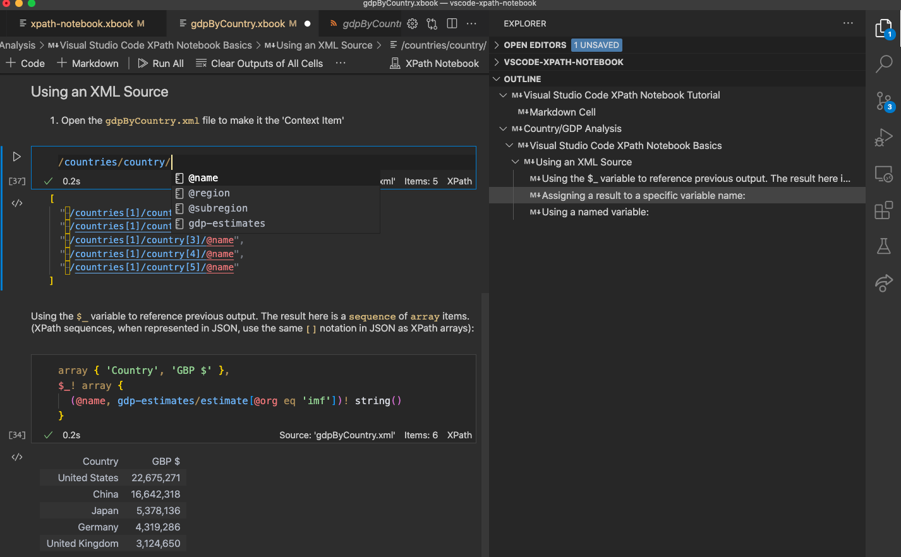
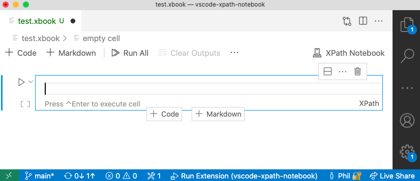
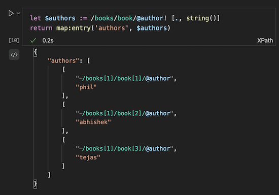
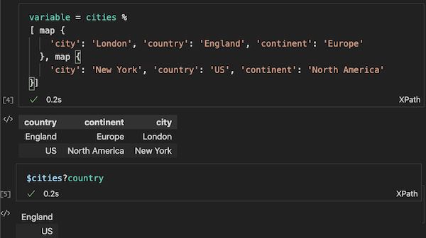
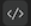
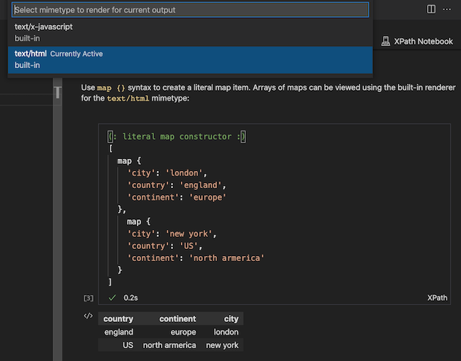

# XPath Notebook for Visual Studio Code

**XPath Notebook** adds XPath 3.1's extensive JSON and XML analysis features to [Visual Studio Code's Notebooks](https://code.visualstudio.com/api/extension-guides/notebook). 
Notebooks are used for data-analysis, code experimentation, tutorials or learning. 



# DeltaXML's XPath Notebook Features

| Feature  | Details |
| ------- | ------- |
| **XPath 3.1 Compatible**    | See W3C specifications for [XPath 3.1](https://www.w3.org/TR/xpath-31/#id-introduction)
| **XPath Processing** | Requires [Node.js](https://nodejs.org/en/) to be installed. Uses Saxonica's [Saxon-JS Processor](https://www.saxonica.com/saxon-js/index.xml)
| **JSON or XML sources** | The context for XPath evaluation can be JSON or XML files
| **Syntax Highlighting**   | Fast and precise - using [Semantic Highlighting](https://code.visualstudio.com/api/language-extensions/semantic-highlight-guide) exclusively
| **Code Formatting**       | For multi-line XPath expressions, 'as-you-type' or 'on-save'
| **Code Diagnostics**      | For XPath Syntax, variable/param references, functions, namespace-prefixes etc.
| **Auto-Completion**       | For XPath functions, variables, function-parameters etc. 
| **Color Theme Support**   | Tested with most popular color themes ([Semantic Highlighting]() must be enabled in settings) 
| **Evaluation Context**   | Sets context item, namespace context, context variables, last result variable
| **Code Folding**          | The indentation of XPath expressions is used to determine fold regions
| **Notebook Context Variables**              | An **XPath Prologue** (e.g. ` variable = countries %` ) assigns the cell result to a notebook variable
| **Last Result Variable**        | Use `$_` to reference the last evaluated notebook cell result
| **Bracket Matching**      | For `()`, `{}`, and `[]`
| **Hover assistance**      | Shows tooltips. Providing signatures and descriptions for all built-in XSLT and XPath
| **JSON output** | View Cell output with the JSON syntax (suitable for 3rd-party renderers) - mime-type: `application/json`
| **Table output** | View Cell output as a simple table - mime-type: `text/html`
| **XML Node navigation** | Navigates to and highlights XML result nodes in the source document
|||


# Introduction

DeltaXML's *XPath Notebook* extension adds comprehensive **XPath 3.1** support to Visual Studio Code's built-in notebooks. Visual Studio Code notebooks provide similar features to other popular notebook interfaces like the  [Juypter Notebook](https://jupyterlab.readthedocs.io/en/latest/user/notebook.html#notebook).

A notebook comprises a set of notebooks cells. These cells can either be **Markdown cells** for narrative content or **Code cells** for a specific programming language.

When a Code cell is executed, the result is rendered in an **Output cell** immediately below the current Code cell. The currently active **NotebookController** (also known as a **Kernel**) determines the output types that can be shown in the Output cell. Each output type will have a corresponding **NotebookRenderer** that is responsible for formatting the output type. For example, the result may be shown as JSON text, as an interactive table or an interactive graphical plot.

# Getting Started

## STEP 1: Setup the XPath Processor

To evaluate XPath expressions, the XPath Notebook requires **Node.js** to be installed. The Node.js installer is available for download from:

 https://nodejs.org/en/.

## STEP 2: Create and save a new XPath Notebook

In Visual Studio Code, create a new file ( `New File` from the command pallette) and save the new file with a `.xbook` filename extension, e.g. `my-notebook.xbook`. The file will then be shown as an empty notebook.
Notebook files are saved in Visual Studio Code in the usual way. For XPath Notebooks, output cells are not included in the notebook file.




## STEP 3: Setup the XPath Evaluation Context

To set the evaluation context item for a notebook just open an XML or JSON file in Visual Studio Code.
The context-item is the result of evaluating either [`doc($uri)`](https://www.w3.org/TR/xpath-functions-31/#func-doc) or 
[`json-doc($uri)`](https://www.w3.org/TR/xpath-functions-31/#func-json-doc) respectively on the last opened file (excluding notebook files).

Here is a summary of the evaluation context:

| Definition  | Details |
| ------- | ------- |
| **Context Item** | [`doc($uri)`](https://www.w3.org/TR/xpath-functions-31/#func-doc) or [`json-doc($uri)`](https://www.w3.org/TR/xpath-functions-31/#func-json-doc) evaluated with last editor URI arg
| **Statically known namespaces** | for prefixes: `array`, `map`, `math`, `xs`, `xsl`|
| **Dynamically known namespaces** | from root element of last opened file - if it was XML |
| **Default element namespace** | any default namespace on root element of last opened XML file |
| **In-scope variables** | `$_` for last cell output <br> variables declared in prolog of executed cells 
| **Static Base URI** | the URI of the current XPath Notebook file
| **Base URI** | the URI of the last opened file - if it was XML

---
## STEP 4: Add and execute Notebook cells

Press the '`+ Code`' or '`+ Markdown`' buttons to add Code or Markdown cells. To execute a cell, press `Ctrl-ENTER` on the keyboard or click on the 'execute' button alongside the cell. When a Code cell is executed the result is shown in the Output cell immediately below the current cell.

For XPath Notebooks the default Output Cell type is JSON text. This allows XPath maps, arrays and sequences to be represented in an intuitive way.

## Step 5: Save the XPath Notebook when done

Use the `CMD-S` keyboard shortcut to save an XPath Notebook so it can be used again. Currently, the Output cell details are not saved.

# General Usage

## Result node navigation

If a result item is an XML node the XPath for the node is shown with special syntax highlighting. Result nodes can be navigated easily: first press and hold the `CMD` button and then click on the XPath in the output cell. The corresponding source XML document will be shown alongside the XPath Notebook, with the corresponding node highlighted.

> To view the string values of XML nodes in the output cell
> you should convert them to a string, for example, using the `string()` function, for example: `/books/book/@author! string()`



*Sample JSON output cell showing special syntax highlighting for XML nodes*

## Add NoteBook Context Variables

XPath expressions in code cells can reference the results of other code cells. The `$_` variable is always set to the result of the previously executed cell. If you want to assign the result of a cell to a specific XPath variable, use a special *XPath Prolog** as the first line.

An XPath Prolog is separated from the XPath expression with the `%` character as this is not a valid XPath operator. The syntax for the prolog is: 
```xml
variable = <name> %
```
In the above, `<name>` is the name of the variable to which we assign the evaluation result of the following XPath expression.

> *Note: The intension is to use the XPath Prolog for other features later.*

In the example below, the result of the `$cities` variable declared in cell `[4]` is used when cell `[5]` is executed:



## Problem Reporting

XPath expressions in Code cells are checked against basic syntax rules. Also, variable names and namespace prefixes are checked using the evaluation context (described above). References to Notebook context variables are marked as invalid until the Code cell with the corresponding variable assignment is executed.

## Auto-completion

Auto-completion is available when editing inside Code cells. Auto-completion is triggered for XPath functions and variable names. The variable names list will include Notebook context variables only once the corresponding cells have been evaluated.

## Choosing Cell Output Type

Currently XPath Notebooks supports two output types:

| Mime-type  | Details |
| ------- | ------- |
| **text/html** | suitable for small data-sets (< 1MB) shows results in tabular form
| **application/json** | for JSON text view or advanced rendering from 3rd party VS Code extensions such as [RandomFractal's VSCode Data Table](https://github.com/RandomFractals/vscode-data-table) 

> **Note**: RandomFractals Data Table renderer supports large data sets and provides column sort and data-type formatting.

 To select an alternative output type, press the  (consolidated) output button or the  (normal) output button shown to the left of the output cell. Then select the `text/html` mime-type. *(See the note below to see how to control what button is shown)*.



> *Note: A Notebook Layout setting (`@tag:notebookLayout consolidated output button`) control whether you see a 'consolidated' or 'normal' button alongside the Notbook output cell. For this extension, it's more convenient to disable the 'consolidated' button.*

# Implementation Detail

## Evaluation

The XPath Notebook uses the [Node.js REPL](https://nodejs.org/api/repl.html#repl_the_node_js_repl) to execute XPath cells. The [Saxon-JS](https://www.npmjs.com/package/saxon-js) NPM module from [Saxonica](https://www.saxonica.com/saxon-js/documentation/index.html) is pre-installed with the extension.

To evaluate an XPath expression the `SaxonJS.transform` function invoked via the Node.js REPL. The XSLT used in the transorm is a compiled *SEF* file, the XPath expression and evaluation context are passed as XSLT parameters. 

Additional namespace bindings are added by the XSLT to the context node for '`array`', '`map`'... prefixes. The XSLT converts the result of an `xsl:evaluate` intruction to the XML representation for JSON by applying templates to the result. The `JSON XML` is then converted to JSON using the `xml-to-json` XPath function.

Prior to evaluation, the XSLT separates any XPath Prolog from the expression. If a variable assignment is found in the prolog, the `ixsl:call` extension function is used to invoke a `setVariable` function on a JavaScript object passed as an XSLT parameter via the API.

`ixsl:get` and `ixsl:call` extension functions are used on the JavaScript object passed as an XSLT parameter to fetch the set of variables added to the Notexbook context by evaluation of previous Code cells.

# XPath Code Editing Features

All XPath code editing features are provided by DeltaXML's companion [XSLT/XPath for Visual Studio Code](https://marketplace.visualstudio.com/items?itemName=deltaxml.xslt-xpath) extension - installed automatically with the XPath Notebook extension.

For documentation on XPath editing features, see the extensions documentation at: [Editing XSLT/XPath](https://deltaxml.github.io/vscode-xslt-xpath/editing-xslt.html)

# XPath Notebook Samples

- Introduction Notebook sample in the code repository at: [notebooks/introduction/xpath-notebook.xbook](https://github.com/DeltaXML/vscode-xpath-notebook/blob/main/notebooks/introduction/xpath-notebook.xbook)


