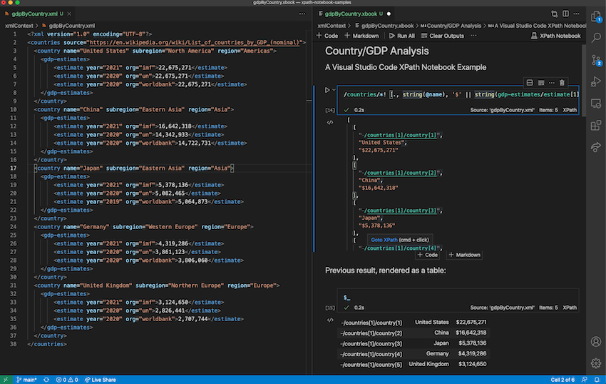

# vscode-xpath-notebook

**A Visual Studio Code notebook extension for XPath 3.1**

*A screenshot of an XPath 3.1 Notebook with the context XML document shown alongside.*

# DeltaXML's XPath Notebook Features

| Feature  | Details |
| ------- | ------- |
| **XPath 3.1 Compatible**    | See W3C specifications for [XPath 3.1](https://www.w3.org/TR/xpath-31/#id-introduction)
| **Syntax Highlighting**   | Fast and precise - using [Semantic Highlighting](https://code.visualstudio.com/api/language-extensions/semantic-highlight-guide) exclusively
| **Code Formatting**       | For multi-line XPath expressions - as you type or on save
| **Code Diagnostics**      | For XPath Syntax, variable/param references, functions etc.
| **XPath Processing** | Using Saxon-JS running in a NodeJS REPL
| **Auto-Completion**       | For XPath functions, variables, function parameters etc. 
| **Color Theme Support**   | Tested with most popular color themes ([Semantic Highlighting]() must be enabled in settings) 
| **Automated Evaluation Context**   | Sets context item, namespace context, context variables, last result variable
| **Code Folding**          | Using indentation
| **Notebook Context Variables**              | An **XPath Prologue** (e.g. ` variable = countries %` ) assigns the cell result to a notebook variable
| **Last Result Variable**        | Use `$_` to reference the last evaluated notebook cell result
| **Bracket Matching**      | For `()`, `{}`, and `[]`
| **Hover assistance**      | Shows tooltips. Providing signatures and descriptions for all built-in XSLT and XPath
| **JSON result format** | (mime-type: `text/x-javascript`) for maps, arrays etc. syntax-highlighter extended for node types
| **Table result format** | (mime-type: `text/html`) shows maps, sequences, arrays or arrays of maps in a table 
|||

## Introduction

DeltaXML's *XPath Notebook* extension adds comprehensive **XPath 3.1** support to Visual Studio Code's built-in notebooks. Visual Studio Code notebooks provide similar features to other popular notebook interfaces like the  [Juypter Notebook](https://jupyterlab.readthedocs.io/en/latest/user/notebook.html#notebook).

A notebook comprises a set of notebooks cells. These cells can either be **Markdown cells** for narrative content or **Code cells** for a specific programming language that can be executed inline.

When a Code cell is executed, the result is rendered in an **Output cell** immediately below the current Code cell. The currently active **NotebookController** determines the output types that can be shown in the Output cell. Each output type will have a corresponding **NotebookRenderer** that is responsible for formatting the output type. For example, the result may be shown as JSON text or as an interactive HTML table.

## Getting Started

Create a new file in Visual Studio Code with the `.xbook` file extension.

A notebook comprises a set of **Markdown** or **Code** cells. Click the '`+ Markdown`' or '`+ Code`' buttons to add a new cell.

To execute the current code cell press `CTRL-Enter` or click on the 'execute cell' button adjacent to the cell.

The result is initially shown using the JSON notation. You can switch to another view by clicking on the '...' button adjacent to the output cell.

Save a notebook file in the same way as other files. 

Output cells are not saved, so the next time you open the notebook file you will see the **Markdown** and **Code** cells but not the output cells.

## Other Documentation / Resources ##

Notebook featues have only been introduced recently to Visual Studio Code. Documentation is therefore limited.  You should however find the [Jupyter Notebooks](https://code.visualstudio.com/learn/educators/notebooks) documentation provides some useful context and a good introduction to the features. Details of the user interface may differ though.

